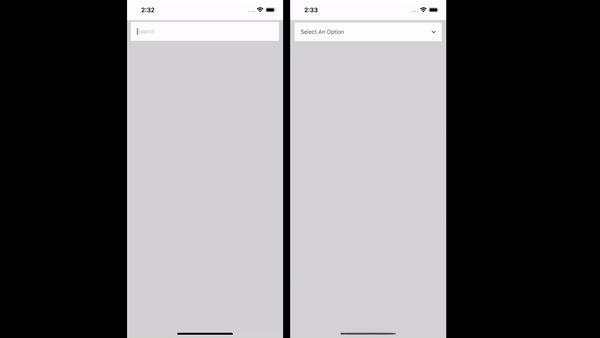

# rn-google-places-autocomplete

[](https://www.npmjs.com/package/rn-google-places-autocomplete)


[](https://bundlephobia.com/package/rn-google-places-autocomplete)

A customizable autocomplete component made for React Native that interacts with the Google Places API, which has several
ways to visualize the places.



# Installation

#### Using npm

```bash
npm i rn-google-places-autocomplete
```

#### Using Yarn

```bash
yarn add rn-google-places-autocomplete
```

#### Using pnpm

```bash
pnpm add rn-google-places-autocomplete
```

### 1. Google Places API KEY

[Get your Google Places API Key](https://developers.google.com/maps/documentation/places/web-service/get-api-key)

### 2. Setup bottom-sheet

`GooglePlacesAutocomplete` component internally
uses [@gorhom/bottom-sheet](https://github.com/gorhom/react-native-bottom-sheet). You need to follow this
[installation steps](https://gorhom.github.io/react-native-bottom-sheet/)

# Usage

<sub>You can take a look at the [example](./example) </sub>

### Configure Bottom sheet modal Provider

If you are going to use the **bottom-sheet** visualization mode, you need to configure
the [bottom sheet modal provider](https://gorhom.github.io/react-native-bottom-sheet/modal), like this:

```tsx
import React from "react"
import { BottomSheetModalProvider } from '@gorhom/bottom-sheet';
import { GooglePlacesAutocomplete } from 'rn-google-places-autocomplete';

const App = () => {
  return (
    <BottomSheetModalProvider>
      <GooglePlacesAutocomplete visualization="bottom-sheet" apiKey="12345" />
    </BottomSheetModalProvider>
  );
};
```

### More Examples

**Controlled Field**

<details>
  <summary>Click to expand</summary>

```tsx
import React, { useState } from 'react';
import { BottomSheetModalProvider } from '@gorhom/bottom-sheet';
import { GooglePlacesAutocomplete, BottomSheetOptionType } from 'rn-google-places-autocomplete';

const App = () => {
  const [selectedOption, setSelectedOption] =
    useState<BottomSheetOptionType | null>(null);
  return (
    <GooglePlacesAutocomplete
      visualization='list'
      apiKey='12345'
      onChange={(option) => setSelectedOption(option)}
      selectedOption={selectedOption}
    />
  );
};
```

</details>

**Limit results to one country**

<details>
  <summary>Click to expand</summary>

```tsx
import React from 'react';
import { BottomSheetModalProvider } from '@gorhom/bottom-sheet';
import { GooglePlacesAutocomplete } from 'rn-google-places-autocomplete';

const App = () => {
  return (
    <BottomSheetModalProvider>
      <GooglePlacesAutocomplete
        visualization='bottom-sheet'
        apiKey='12345'
        query={{
          components: 'country:co', // Limit to Colombia's Places
          types: '(cities)', // Limit search to cities
          language: 'es',// response in spanish
        }}
      />
    </BottomSheetModalProvider>
  );
};
```

</details>

## TODO:

- [ ] Improve documentation
    - [ ] Add props and methods
    - [ ] Add styles customization
- [ ] Add more examples

## License

[MIT](LICENSE)

### Authors

- [santigp258](https://twitter.com/blasanti258)
